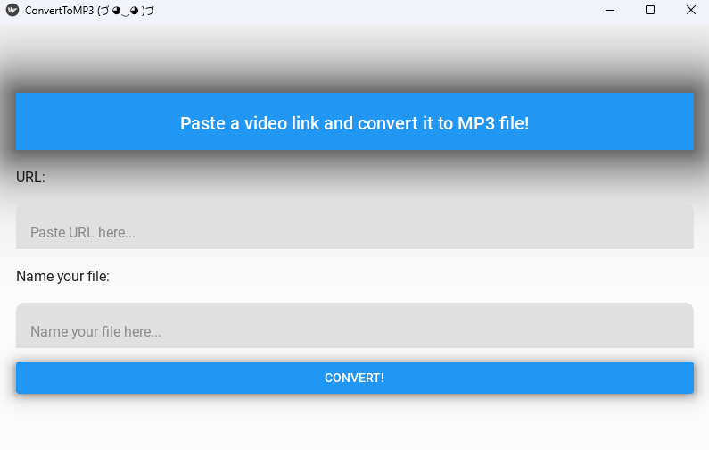

# convertVideoToAudio 

## Description
This is a basic tool to convert videos to audio using URL's.

## Installation

1. Clone the repository:
    ```bash
   git clone https://github.com/Luisjauregui6/convertVideoToAudio.git
    ```
2. Navigate into the project directory:
    ```bash
    cd convertVideoToAudio
    ```
3. Install requirements:
    ```bash
    pip install -r requirements.txt
    ```
4. Run the program:
    ```bash
    python converter.py
    ```

## Usage
To run the app, follow the steps:

1. start the application:
   ```bash
   python converter.py
   ```

2. Paste a link in the URL field.
3. Name your MP3 file.
4. Press the "convert" button and wait.

## Screenshot


## Contributing
1. Fork the repository.
2. Create a new branch (`git checkout -b feature-branch`)
3. Make your changes.
4. Commit your changes (`git commit -m 'Add new feature'`).
5. Push to your fork (`git push origin feature-branch`).
6. Create a new pull request.

## License 
MIT
